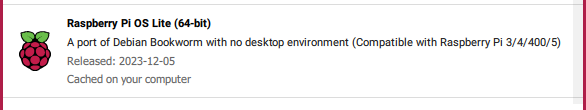
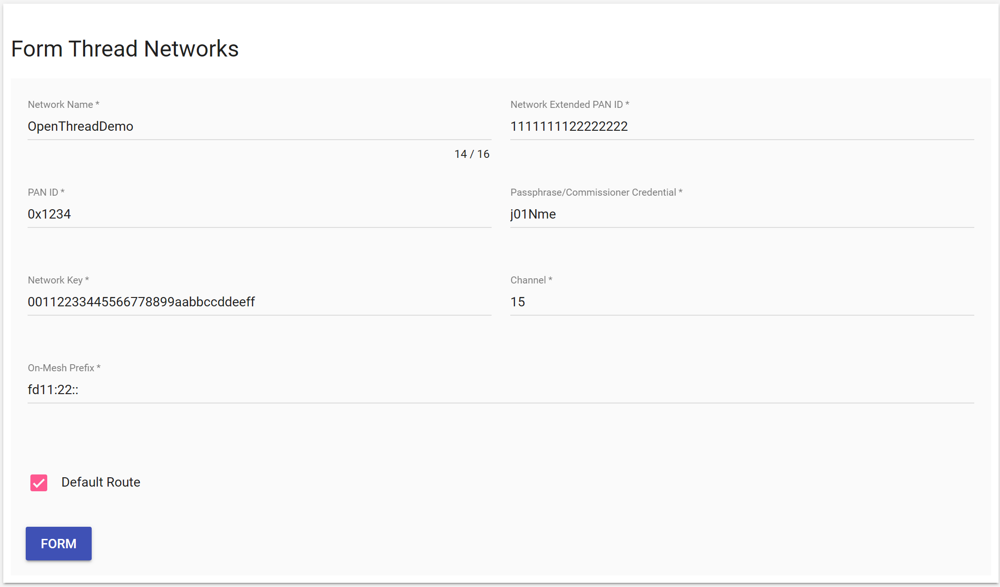

# Building a OpenThread Border Router using a Raspberry Pi
### Author: [Olav Tollefsen](https://www.linkedin.com/in/olavtollefsen/)

## Introduction

This article shows how to build an OpenThread Border Router using a Raspberry Pi.

## Install the OpenThread Border Router software on a Raspberry Pi

### Prepare the Raspberry Pi

Flash an approperiate version of the Raspberry Pi OS.



### Update the OS

```
$ sudo apt-get update
$ sudo apt-get upgrade
```

### Configure static IP-address

If you want to configure a static IP-address, you can use this command:

```
sudo nmtui
```

### Install Git

```
$ sudo apt install git
```

### Clone the OTBR repository:

```
$ git clone https://github.com/openthread/ot-br-posix
```

### Install dependencies

```
$ cd ot-br-posix
$ WEB_GUI=1
$ ./script/bootstrap
```

### Compile and install OTBR

```
$ WEB_GUI=1
$ INFRA_IF_NAME=eth0 ./script/setup
```

### Reboot the Raspberry Pi

The OTBR service should start on boot.

### Check the services

Verify that all required services are enabled:

```
$ sudo systemctl status
```

```
$ sudo service mdns status
```

```
$ sudo service otbr-agent status
```

```
$ sudo service otbr-web status
```

### Stop / Start a service

```
$ sudo service otbr-agent stop
```

```
$ sudo service otbr-agent start
```

### Verify RCP

Verify that the RCP is in the correct state:

```
sudo ot-ctl state
```

Responses should be like these:

```
disabled
Done
```

```
router
Done
```

#### Form a new Thread network

```
sudo ot-ctl factoryreset
sleep 3
sudo ot-ctl srp server disable
sudo ot-ctl thread stop
sudo ot-ctl ifconfig down
sudo ot-ctl dataset init new
sudo ot-ctl dataset commit active
sudo ot-ctl srp server enable
sudo ot-ctl ifconfig up
sudo ot-ctl thread start
```

### Obtaining Thread network credentials

When running directly on hardware:

```
sudo ot-ctl dataset active -x | sed -n 1p | sed -e "s/\r//g"
```

When running in Docker container

```
$ docker exec -it <container_id> sh -c "sudo ot-ctl dataset active -x"
```

## Run the OpenThread Border Router software on a Raspberry Pi using the Docker image (not working)

### Install Docker

Instructions are copied from:

https://docs.docker.com/engine/install/debian/

Run the following command to uninstall all conflicting packages:

```
for pkg in docker.io docker-doc docker-compose podman-docker containerd runc; do sudo apt-get remove $pkg; done
```

Install using the apt repository:

1. Set up Docker's apt repository:
```
# Add Docker's official GPG key:
sudo apt-get update
sudo apt-get install ca-certificates curl gnupg
sudo install -m 0755 -d /etc/apt/keyrings
curl -fsSL https://download.docker.com/linux/debian/gpg | sudo gpg --dearmor -o /etc/apt/keyrings/docker.gpg
sudo chmod a+r /etc/apt/keyrings/docker.gpg

# Add the repository to Apt sources:
echo \
  "deb [arch=$(dpkg --print-architecture) signed-by=/etc/apt/keyrings/docker.gpg] https://download.docker.com/linux/debian \
  $(. /etc/os-release && echo "$VERSION_CODENAME") stable" | \
  sudo tee /etc/apt/sources.list.d/docker.list > /dev/null
sudo apt-get update
```

2. Install the Docker packages

```
sudo apt-get install docker-ce docker-ce-cli containerd.io docker-buildx-plugin docker-compose-plugin
```

Create the docker group and add your user:

```
sudo groupadd docker
sudo usermod -aG docker $USER
```

You may need to reboot for the group membership to take effect.

### Run OpenThread Border Router on the Raspberry Pi (Docker)

Connect the Silicon Labs Dev Kit to an USB-port on the Raspberry Pi. A new port should appear under /dev. Typically named ttyACM0.

Remember to load the kernel modules for iptables:

```
$ sudo modprobe ip6table_filter
```

Make it permanent

```
sudo nano /etc/modules-load.d/modules.conf
```

Add a line with "ip6table_filter" and save.

Check if the "ip6table_filter" module is loaded:

```
lsmod | grep ip6table_filter
```

Run the following Docker command:

```
$ docker run --sysctl "net.ipv6.conf.all.disable_ipv6=0 net.ipv4.conf.all.forwarding=1 net.ipv6.conf.all.forwarding=1" -p 8080:80 --dns=127.0.0.1 -it --volume /dev/ttyACM0:/dev/ttyACM0 --privileged openthread/otbr --radio-url spinel+hdlc+uart:///dev/ttyACM0
```

The OpenThread Border Router should now be running.

## Form a Thread network

Open the IP-address of your Raspberry Pi on port 8080 to open the OpenThread Border Router Web Application.

Click on Form in the menu and then click on the "Form" button.



## Backup

OpenThread Border Router stores it's state by default in /var/lib/thread. This can be changed by setting the environment variable OT_POSIX_SETTINGS_PATH at build time.

To backup the state of the OpenThread Border Router you need to backup the file(s) in this directory.

NOTE! The settings filename for each RCP will be uniqueue. If you swap an RCP, you need to make sure that the settings file for the old RCP is copied to the settings file for the new RCP. 

## Network Troubleshooting

https://openthread.io/reference/cli/commands

Discover network topology (list of routers and their connections). Parameters are optional and indicate additional items to discover.

```
 sudo ot-ctl meshdiag topology [ip6-addrs] [children]
```

Prints information in table format about all neighbors.

```
 sudo ot-ctl neighbor table
```

Prints the connection time and age of neighbors.

```
 sudo ot-ctl neighbor conntime
```

Prints link quality information about all neighbors.

```
 sudo ot-ctl neighbor linkquality
```

Prints a list of routers in a table format.

```
 sudo ot-ctl router table
```

Discover network topology (list of routers and their connections). Parameters are optional and indicate additional items to discover. Can be added in any order.

```
 sudo ot-ctl meshdiag topology
```

Gets (or sets with the use of the optional txpower argument) the transmit power in dBm.

```
 sudo ot-ctl txpower
```

Gets the OpenThread version string.

```
 sudo ot-ctl version
```

Gets the Thread protocol version.

```
 sudo ot-ctl thread version
```

You can also use avahi-browse command to display the Thread version number:

```
avahi-browse -r -t _meshcop._udp
```

Look for this kind of string in the output "tv=1.3.0"

avahi-browse is a command-line program that you can use to browse for all mDNS broadcasts on the network and to resolve the host name and IP address of the device performing the broadcasts.

```
sudo apt-get install avahi-utils 
```

```
avahi-browse -a

avahi-browse -r -t _meshcop._udp
```

```
 dns-sd -B _meshcop._udp

 dns-sd -B _meshcop._udp local

 dns-sd -L "OpenThread BorderRouter (#3991)" _meshcop._udp local
```